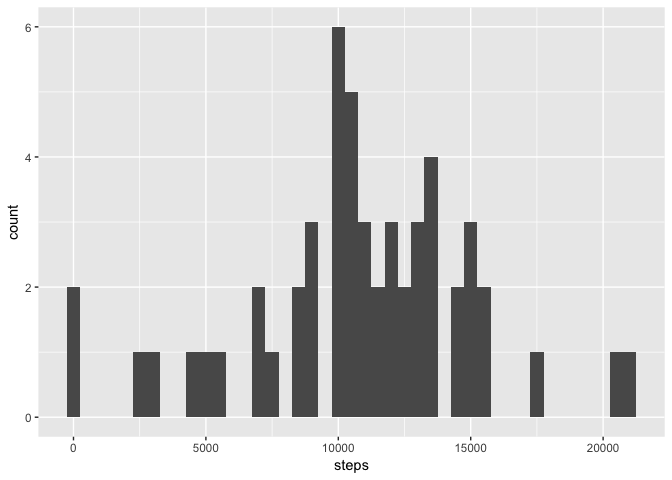
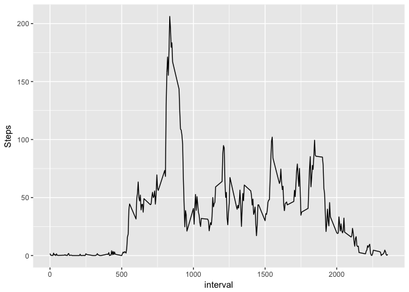
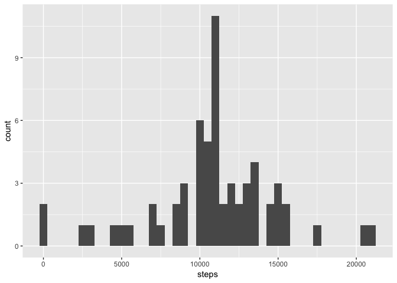
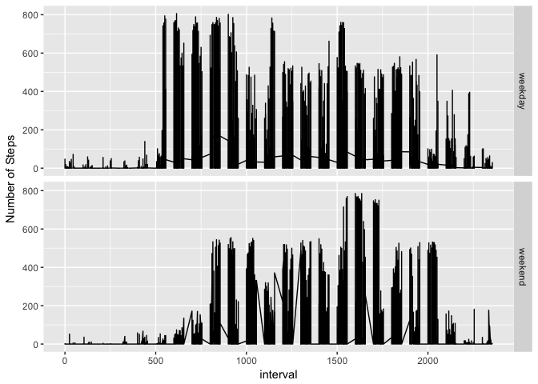

# Reproducible Research: Peer Assessment 1


## Loading and preprocessing the data
Obtain the raw data file by doing the minimum work to get it. 

```r
zipfile <- "activity.zip"
datafile <- "activity.csv"
if (!file.exists(datafile)) {
  unzip(zipfile)
}
```

Read in the csv file and convert to a tibble (I'm a 'hadleyverse' fan!) 

```r
suppressPackageStartupMessages(library(dplyr))
raw.data <- tbl_df(read.csv(datafile))
```

## What is mean total number of steps taken per day?
*1. Make a histogram of the total number of steps taken each day*

To make a histogram of the total number of steps taken each day lets first clean the data up (i.e. remove any rows that have an `NA` in them), then group by the data and summarize by the sum of the steps. We'll then relabel the columns to make it easy to keep track of everything:

```r
clean.data <- na.omit(raw.data)
data.by_day <- group_by(clean.data, date) %>% summarize(data.by_day=sum(steps))
names(data.by_day) <- c("date", "steps")
```
With the data all cleaned up its a simple call to `qplot` to give us the histogram

```r
library(ggplot2, verbose = FALSE, quietly = TRUE)
qplot(steps, data=data.by_day, binwidth=500)
```

<!-- -->

*2. Calculate and report the mean and median total number of steps taken per day*

The mean and median number of steps taken each day are calculated thus:

```r
nos.mean <- mean(data.by_day$steps)
nos.median <- median(data.by_day$steps)
```
The mean and median number of steps taken each day, ignoring rows with missing data are 1.0766189\times 10^{4} & 10765, respectively.

## What is the average daily activity pattern?
*1. Make a time series plot (i.e. type = "l") of the 5-minute interval (x-axis) and the average number of steps taken, averaged across all days (y-axis)*

To see the average daily activity pattern (`adap`) we're going to group by the interval, then summarize by the mean for each interval and rename the columns to tidy things up:

```r
adap <- group_by(clean.data, interval) %>% summarise(mean(steps))
names(adap) <- c("interval", "Steps")
```

Then we'll use `qplot` to look at these 5 minute intervals:

```r
qplot(interval, Steps, data=adap, geom='line')
```

<!-- -->

*2. Which 5-minute interval, on average across all the days in the dataset, contains the maximum number of steps?*

To calculate the 5-minute interval with the maximum number of steps we'll use the `dplyr::top_n` function:

```r
i.max <- top_n(adap, 1, Steps)$interval
```
The 5 minute interval that has the average most number of steps is 835.

## Imputing missing values
*1. Calculate and report the total number of missing values in the dataset (i.e. the total number of rows with NAs)*

To figure out the missing values (i.e. `NA`) in the data set, we convert the `raw.data` to a logical array indicating which cells are  `NA`:

```r
na_array <- is.na(raw.data)
```
We then apply the `any` function to each row to get a vector which is `TRUE` when any column in the corresponding row is `TRUE`; i.e. had an `NA` value in the original data set. We can count the number of such rows using `sum`, because `TRUE` is converted to a `1` and `FALSE` is converted to a `0` when doing integer arithmetic on a logical vector.

```r
sum(apply(na_array, 1, any))
```

```
## [1] 2304
```
So we see there are 2304 rows that contain at least one `NA`.

*2. Devise a strategy for filling in all of the missing values in the dataset. The strategy does not need to be sophisticated. For example, you could use the mean/median for that day, or the mean for that 5-minute interval, etc.*

Firstly we need to see if the data is missing from just the `steps` column, or one of the other columns? Lets look at what happens if we sum the columns of the `na_array`:

```r
apply(na_array, 2, sum)
```

```
##    steps     date interval 
##     2304        0        0
```

So we know that all the missing data is in the `steps` column. That will make things easier!

My strategy will be to simply replace missing values with the average for that interval, taken from the table `adap`, calculated earlier. 

*3. Create a new dataset that is equal to the original dataset but with the missing data filled in.*

We'll do this by doing a full join between the `raw.data` table and the `adap` table on the `interval` column. This will give us a new table with a new column `Steps` containing the average steps per interval. We can then mutate this table to create the final set of steps (in a column called `steps2`) by selecting the average steps (from the `Steps` column) if it is `NA` and the original `steps` value otherwise. We'll then select just the columns we want, and rename them to match the original `raw.data` data frame:


```r
imputed.data <- full_join(raw.data, adap, by=c("interval")) %>% 
  mutate(steps2=ifelse(is.na(steps), Steps, steps)) %>%
  select(steps2, date, interval) %>% rename(steps = steps2)
```


*4. Make a histogram of the total number of steps taken each day and Calculate and report the mean and median total number of steps taken per day. Do these values differ from the estimates from the first part of the assignment? What is the impact of imputing missing data on the estimates of the total daily number of steps?*

The calculation and histogram plot is identical to what we did earlier, but just using the `imputed.data`.

```r
imputed.data.by_day <- group_by(imputed.data, date) %>% summarize(imputed.data.by_day=sum(steps))
names(imputed.data.by_day) <- c("date", "steps")
qplot(steps, data=imputed.data.by_day, binwidth=500)
```

<!-- -->

Similarly for the mean and median number of steps:

```r
new.nos.mean <- mean(imputed.data.by_day$steps)
new.nos.median <- median(imputed.data.by_day$steps)
```

The mean and median number of steps taken per day are 1.0766189\times 10^{4} and 1.0766189\times 10^{4}.

The differences between the old and the new mean and median are 0 and 1.1886792

So the values do differ from the original values, but not by much.

The impact of imputing missing data on the estimates of the total daily number of steps was not to change the mean but to bring the median in line with the mean.

## Are there differences in activity patterns between weekdays and weekends?
*Create a new factor variable in the dataset with two levels -- "weekday" and "weekend" indicating whether a given date is a weekday or weekend day.*

We'll create this new factor variable by first creating a new `day` variable by converting each `date` value to a `POSIXct` value and then using the `weekdays()` function to get the name of the day. We'll then use that to construct a `Weekend` factor variable that has the value `weekend` if its a `Saturday` or a `Sunday`, and `weekday` otherwise. We'll then select just the columns (`steps`, `interval`, `Weekend`) that we need:

```r
weekday.data <- imputed.data %>%
  mutate(day=weekdays(as.POSIXct(strptime(date, format="%Y-%m-%d")))) %>%
  mutate(Weekend=as.factor(ifelse(day %in% c('Saturday', 'Sunday'), "weekend", "weekday"))) %>%
  select(steps, interval, Weekend)
```


*Make a panel plot containing a time series plot (i.e. type = "l") of the 5-minute interval (x-axis) and the average number of steps taken, averaged across all weekday days or weekend days (y-axis).*

So what we have to do here is to group by the interval, then by the weekday and average those groups:

```r
weekday.data.averaged <- group_by(weekday.data, interval, Weekend) %>% summarize(mean(steps)) 
names(weekday.data.averaged) <- c('interval', 'Weekend', 'steps')
```
We can plot this using `ggplot` to provide the line plot of `interval` against `step`, adding a `facet_grid` to separate out the `weekday` data from the `weekend` data:

```r
ggplot(weekday.data, aes(interval, steps)) + geom_line() + facet_grid(Weekend ~ .) + labs(y='Number of Steps')
```

<!-- -->
